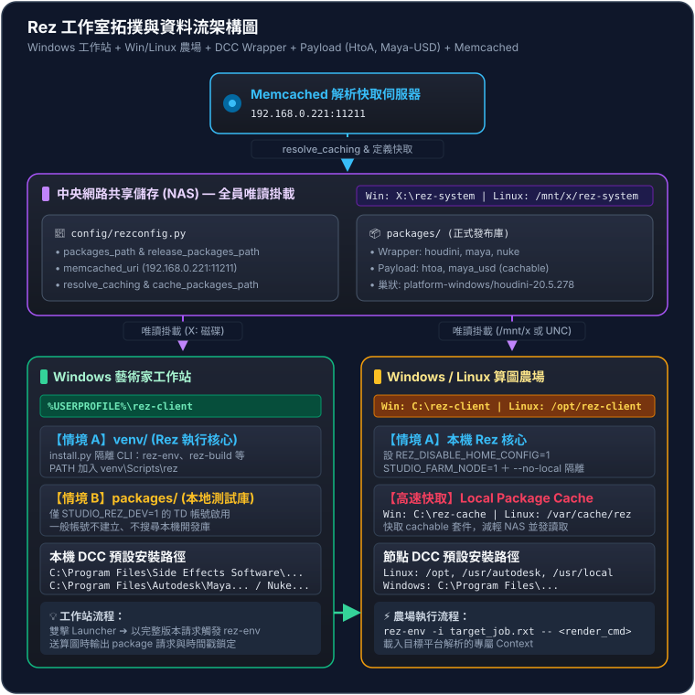

# Rez 工作室導入架構與模擬規劃總覽

本文檔為工作室在混合作業系統（Windows 藝術家工作站 + Windows/Linux 混成算圖農場）環境下，導入 Rez 套件管理與環境解析系統的頂層藍圖。

本系列規劃筆記專門針對以下生產環境進行完整模擬：
1. **中央儲存與映射**：Windows `X:\rez-system` 與 Linux `/mnt/x/rez-system`。
2. **高效能解析快取**：配置專屬 Memcached 伺服器 `192.168.0.221:11211`。
3. **客戶端雙軌分工**：區分「情境 A（Rez 執行核心）」與「情境 B（個人本地測試套件庫）」。
4. **預設安裝路徑 DCC Wrapper**：針對本機與農場預設路徑安裝的 **Houdini**、**Maya**、**Nuke** 進行完整封裝。
5. **農場無縫還原**：透過平台專屬 Context 檔案（`.rxt`）與本機快取（`cache_packages_path`）大幅減輕農場向 NAS 併發讀取的頻寬負擔。

---

## 一、系統拓撲與架構圖

---

## 二、核心規劃決策

### 1. 雙軌目錄分工：情境 A 與情境 B
- **情境 A（Rez 執行核心 - `rez-client/venv`）**：
  每台工作站與農場節點本機皆安裝獨立的 Rez Python 虛擬環境，提供 `rez-env`、`rez-build`、`rez-context` 等原生 CLI 指令。此設計可避免網路磁碟連線抖動導致終端指令完全停擺。
- **情境 B（個人本地測試套件庫 - `rez-client/packages`）**：
  提供給 Pipeline TD 或開發人員在本機開發、建置（`rez-build -i`）新套件。全域 `rezconfig.py` 將其置於 `packages_path` 第一順位，測試完成前不推入中央磁碟，杜絕改壞全公司環境的風險。一般美術電腦此目錄維持為空。

### 2. Memcached 叢集加速解析
在大型專案或複雜外掛依賴下，Rez 解析（Resolve）需要對檔案系統進行大量的 stat 與讀取。透過指向 `192.168.0.221:11211`，所有解析結果與 package 定義會自動儲存於記憶體快取中，大幅提升工作站啟動速度，並避免算圖農場爆發式啟動時癱瘓 NAS。

### 3. 大型商業 DCC 採用 Wrapper 模式
Houdini、Maya 與 Nuke 等大型商業軟體若直接整包放入中央 NAS，不僅會霸佔數百 GB 儲存空間，更會在多人或農場併發啟動時造成龐大網路吞吐。因此本架構嚴格遵循 **「軟體安裝在各機預設路徑，Rez 僅存放輕量 Wrapper Package」** 的原則，由 `package.py` 動態探測作業系統與路徑並注入環境變數。

### 4. 渲染器外掛與擴充套件採用 Payload 模式（Variants 變體）
與本機預設安裝的 DCC 不同，**Arnold (HtoA)** 與 **Maya-USD** 等外掛是以實體負載（Payload）形式直接發布至中央 NAS。透過宣告 `variants`（如 `["platform-windows", "houdini-20.5.278"]`），Rez 會依據作業系統與宿主 DCC 版本自動載入精確相容的二進位組件與 Python 模組。

---

## 三、系列規劃筆記導覽

本系列筆記依據實施先後順序劃分如下：

1. [01-中央伺服器與全域配置](docs/01-中央伺服器與全域配置.md)：中央儲存規劃、Memcached 配置與生產級 `rezconfig.py` 設定檔。
2. [02-客戶端與算圖農場部署](docs/02-客戶端與算圖農場部署.md)：工作站情境 A/B 部署、環境變數與農場 `.rxt` 派送流程。
3. [03-DCC-Wrapper-規範與預設路徑](docs/03-DCC-Wrapper-規範與預設路徑.md)：商業軟體 Wrapper 機制、預設路徑對照矩陣與撰寫金律。
4. [04-Houdini-Wrapper-套件實作](docs/04-Houdini-Wrapper-套件實作.md)：Houdini 跨平台 Wrapper `package.py` 完整程式碼與環境變數設定。
5. [05-Maya-Wrapper-套件實作](docs/05-Maya-Wrapper-套件實作.md)：Maya 跨平台 Wrapper `package.py` 完整程式碼與啟動設定。
6. [06-Nuke-Wrapper-套件實作](docs/06-Nuke-Wrapper-套件實作.md)：Nuke 跨平台 Wrapper `package.py` 完整程式碼與終端執行配置。
7. [07-環境解析與農場驗證模擬](docs/07-環境解析與農場驗證模擬.md)：端到端工作流演練、Memcached 命中測試與跨平台 Context 驗證。
8. [08-外掛Payload套件規範與Variants機制](docs/08-外掛Payload套件規範與Variants機制.md)：實體負載套件原理、二進位 ABI 相依矩陣與 `{root}` 動態尋址。
9. [09-HtoA-Arnold-Houdini外掛實作](docs/09-HtoA-Arnold-Houdini外掛實作.md)：Arnold for Houdini (HtoA) 完整 Payload 套件、`HOUDINI_PATH` 堆疊與 Kick CLI。
10. [10-Maya-USD外掛套件實作](docs/10-Maya-USD外掛套件實作.md)：Maya-USD 模組化 Payload 套件、Autodesk Module (`.mod`) 整合與 USD API 驗證。
